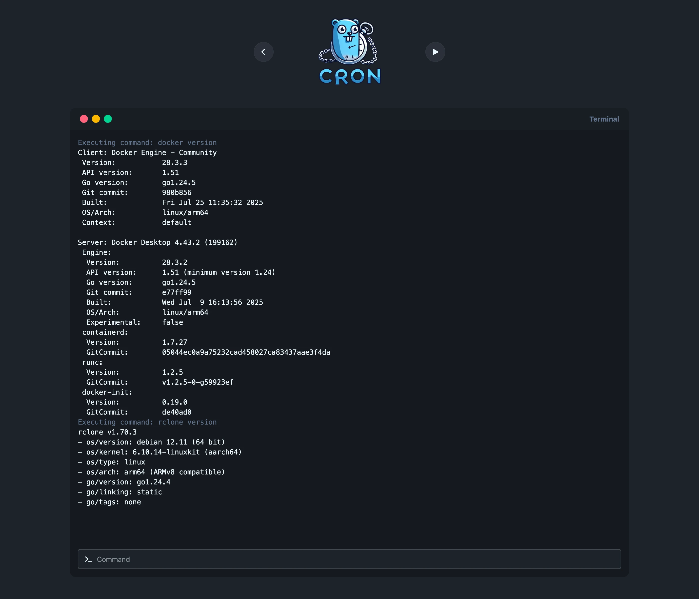
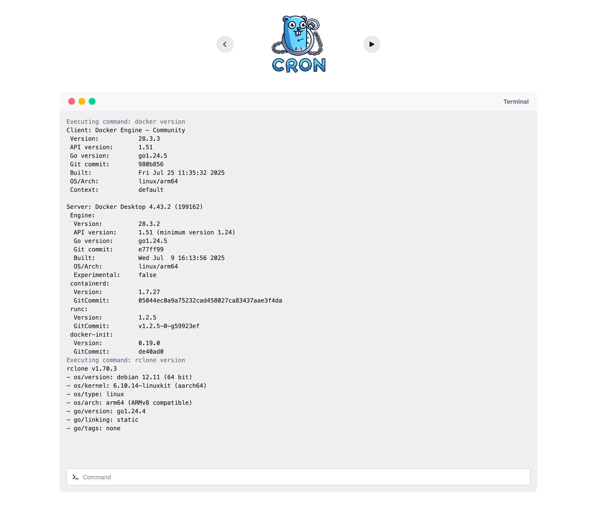

<div align="center">


[](https://github.com/flohoss/gocron/actions/workflows/release.yaml)
[](https://github.com/flohoss/gocron)

A task scheduler built with Go and Vue.js that allows users to specify recurring jobs via a simple YAML configuration file. The scheduler reads job definitions, executes commands at specified times using cron expressions, and passes in environment variables for each job.

</div>

## Table of Contents

- [Table of Contents](https://www.google.com/search?q=%23table-of-contents)
- [Features](https://www.google.com/search?q=%23features)
- [How It Works](https://www.google.com/search?q=%23how-it-works)
- [Docker](https://www.google.com/search?q=%23docker)
  - [run command](https://www.google.com/search?q=%23run-command)
  - [compose file](https://www.google.com/search?q=%23compose-file)
- [Screenshots](https://www.google.com/search?q=%23screenshots)
  - [Home](https://www.google.com/search?q=%23home)
  - [Job](https://www.google.com/search?q=%23job)
  - [Installed software](https://www.google.com/search?q=%23installed-software)
  - [Terminal](https://www.google.com/search?q=%23terminal)
  - [OpenAPI Specification (/api/docs)](https://www.google.com/search?q=%23openapi-specification-apidocs)
- [Configuration File](https://www.google.com/search?q=%23configuration-file)
  - [YAML Configuration](https://www.google.com/search?q=%23yaml-configuration)
  - [Example Configuration](https://www.google.com/search?q=%23example-configuration)
- [Preinstalled Software](https://www.google.com/search?q=%23preinstalled-software)
- [✨ Star History](https://www.google.com/search?q=%23-star-history)
- [License](https://www.google.com/search?q=%23license)
- [Development setup](https://www.google.com/search?q=%23development-setup)
  - [Automatic rebuild and reload](https://www.google.com/search?q=%23automatic-rebuild-and-reload)
  - [Rebuild types](https://www.google.com/search?q=%23rebuild-types)

## Features

- Simple Configuration: Easily define jobs, cron schedules, and environment variables in a YAML config file.
- Cron Scheduling: Supports cron expressions for precise scheduling.
- Environment Variables: Define environment variables specific to each job.
- Easy Job Management: Add and remove jobs quickly with simple configuration.
- Pre-installed backup-software for an easy backup solution

## How It Works

- Defaults Section: This section defines default values that are applied to all jobs. You can specify a default cron expression and environment variables to be inherited by each job.
- Jobs Section: Here, you define multiple jobs. Each job can have its own cron expression, environment variables, and commands to execute.
- Environment Variables: Define environment variables for each job to customize its runtime environment.
- Commands: Each job can have multiple commands, which will be executed in sequence.

## Docker

### run command

```sh
docker run -it --rm \
  --name gocron \
  --hostname gocron \
  -p 8156:8156 \
  -v ./config/:/app/config/ \
  ghcr.io/flohoss/gocron:latest
```

### compose file

```yml
services:
  gocron:
    image: ghcr.io/flohoss/gocron:latest
    restart: always
    container_name: gocron
    hostname: gocron
    volumes:
      - ./config/:/app/config/
    ports:
      - '8156:8156'
```

## Screenshots

### Home


### Job


### Terminal





### OpenAPI Specification (/api/docs)


## Configuration File

### YAML Configuration

The entire configuration is managed via the YAML file, including settings for the timezone, logging, and server.

For a complete and working configuration example, please refer to the [`config.yaml`](/config/config.yaml) file in the repository.

### Example Configuration

You can specify the software you want to install and the version you want to use directly in the configuration file.
Only some software is available, but options might increase in the future.
Here is an example of how to set up specific software versions:

```yaml
software:
  - name: 'apprise'
    version: '1.2.0'
  - name: 'borgbackup'
    version: '1.2.0'
  - name: 'docker'
    version: '5:24.0.5-1~debian.11~bullseye'
  - name: 'restic'
    version: '0.14.0'
```

## ✨ Star History

<picture>
  <source media="(prefers-color-scheme: dark)" srcset="https://api.star-history.com/svg?repos=flohoss/gocron&type=Date&theme=dark" />
  <source media="(prefers-color-scheme: light)" srcset="https://api.star-history.com/svg?repos=flohoss/gocron&type=Date" />
  
</picture>

## License

This project is licensed under the MIT License - see the [LICENSE](https://github.com/flohoss/gocron/blob/main/LICENSE) file for details.

## Development setup

### Automatic rebuild and reload

```sh
docker compose up
```

### Rebuild types

```sh
# Run docker compose up first for the types to be generated

docker compose run --rm types
```
