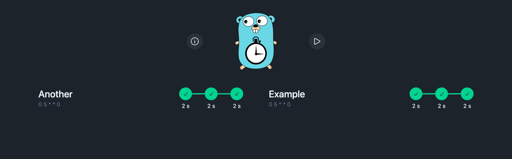
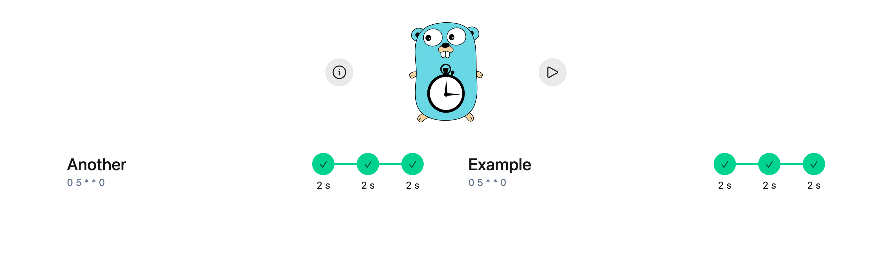
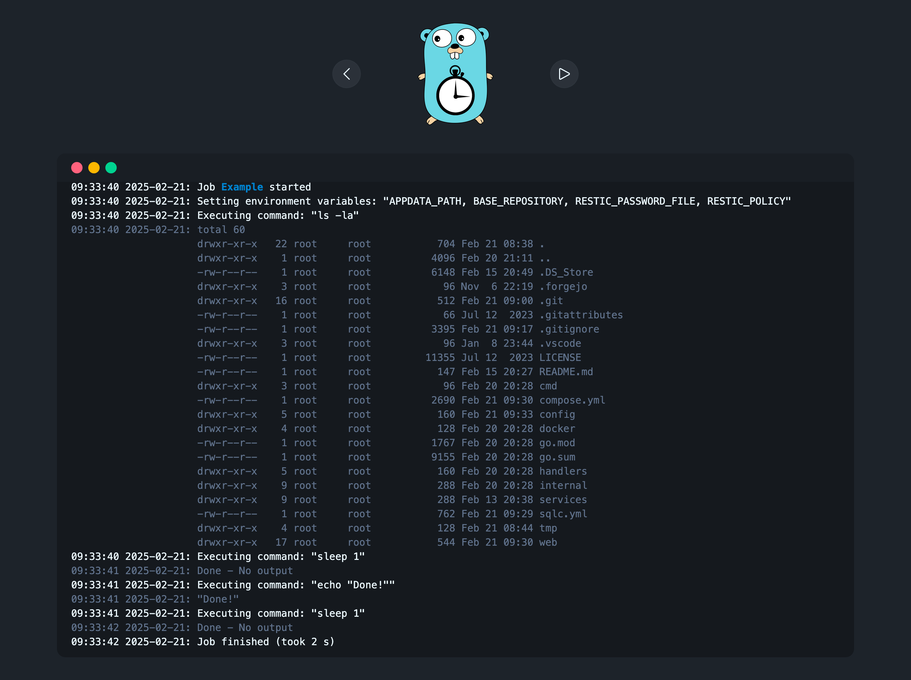
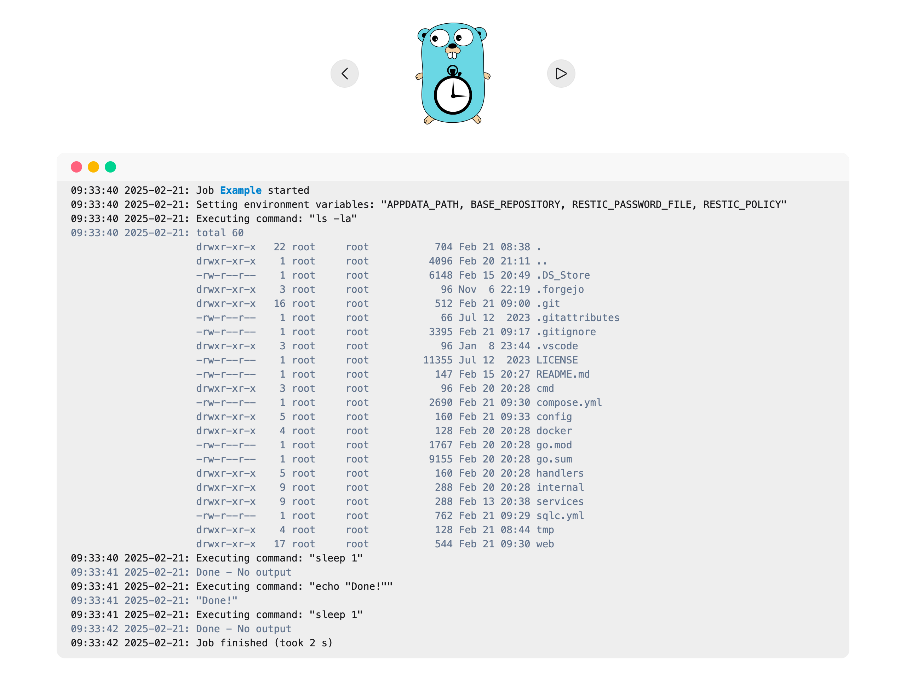
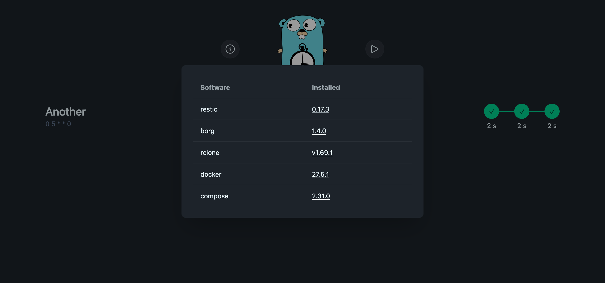
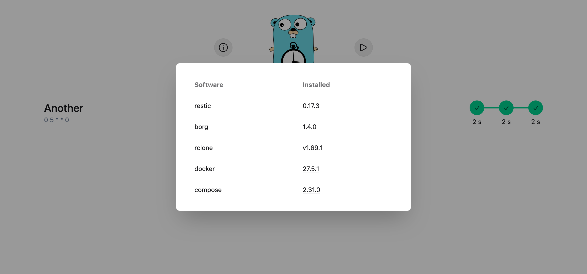
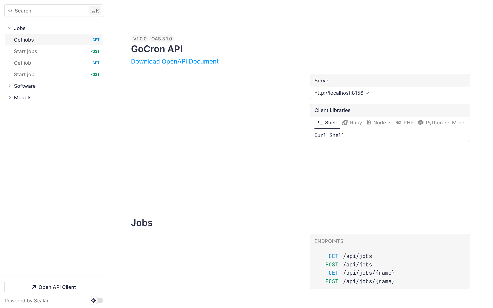

# GoCron


[](https://github.com/flohoss/gocron/actions/workflows/release.yaml)
[](https://github.com/flohoss/gocron)

A task scheduler built with Go and Vue.js that allows users to specify recurring jobs via a simple YAML configuration file. The scheduler reads job definitions, executes commands at specified times using cron expressions, and passes in environment variables for each job.

## Features

- Simple Configuration: Easily define jobs, cron schedules, and environment variables in a YAML config file.
- Cron Scheduling: Supports cron expressions for precise scheduling.
- Environment Variables: Define environment variables specific to each job.
- Easy Job Management: Add and remove jobs quickly with simple configuration.
- Pre-installed backup-software for an easy backup solution

## How It Works

- Defaults Section: This section defines default values that are applied to all jobs. You can specify a default cron expression and environment variables to be inherited by each job.
- Jobs Section: Here, you define multiple jobs. Each job can have its own cron expression, environment variables, and commands to execute.
- Environment Variables: Define environment variables for each job to customize its runtime environment.
- Commands: Each job can have multiple commands, which will be executed in sequence.

## Screenshots

### Home





## Job





## Installed software





### OpenAPI Specification (/api/docs)




## Example docker

```yml
services:
  gocron:
    image: ghcr.io/flohoss/gocron:latest
    restart: always
    container_name: gocron
    hostname: gocron
    environment:
      - TZ=Europe/Berlin
      # to get notification of runs enable ntfy
      # - NTFY_URL=https://ntfy.hoss.it/
      # - NTFY_TOPIC=Backup
      # - NTFY_TOKEN=<token>
    volumes:
      - ./config/:/app/config/
      # if you want to use restic with password file
      # - ./.resticpwd:/secrets/.resticpwd
      # preconfigure a rclone config and use it here
      # - ./.rclone.conf:/root/.config/rclone/rclone.conf
      # to run docker commands mount the socket
      # - /var/run/docker.sock:/var/run/docker.sock
    port:
      - '8156:8156'
```

## Example Configuration

The following is an example of a valid YAML configuration creating backups with restic every 3 am in the morning and cleaning the repo every Sunday at 5 am:

```yml
defaults:
  cron: '0 3 * * *'
  envs:
    - key: RESTIC_PASSWORD_FILE
      value: '/secrets/.resticpwd'
    - key: BASE_REPOSITORY
      value: 'rclone:pcloud:Server/Backups'
    - key: APPDATA_PATH
      value: '/mnt/user/appdata'

jobs:
  - name: Cleanup
    cron: '0 5 * * 0'
    envs:
      - key: RESTIC_POLICY
        value: '--keep-daily 7 --keep-weekly 5 --keep-monthly 12 --keep-yearly 75'
      - key: RESTIC_POLICY_SHORT
        value: '--keep-last 7'
    commands:
      - command: restic -r ${BASE_REPOSITORY}/forgejo forget ${RESTIC_POLICY} --prune
      - command: restic -r ${BASE_REPOSITORY}/paperless forget ${RESTIC_POLICY} --prune
  - name: Forgejo
    envs:
      - key: RESTIC_REPOSITORY
        value: ${BASE_REPOSITORY}/forgejo
    commands:
      - command: docker exec -e PASSWORD=password forgejo-db pg_dump db --username=user
        file_output: ${APPDATA_PATH}/forgejo/.dbBackup.sql
      - command: restic backup ${APPDATA_PATH}/forgejo
  - name: Paperless
    envs:
      - key: RESTIC_REPOSITORY
        value: ${BASE_REPOSITORY}/paperless
    commands:
      - command: docker exec paperless document_exporter ${APPDATA_PATH}/paperless/export
        file_output: ${APPDATA_PATH}/paperless/.export.log
      - command: restic backup ${APPDATA_PATH}/paperless
```

# Preinstalled Software

These tools are preinstalled and ready to be used for various operations within your jobs:

1. [BorgBackup](https://www.borgbackup.org/)

> BorgBackup is a fast, secure, and space-efficient backup tool. It deduplicates data and can be used for both local and remote backups. It is widely known for its encryption and compression capabilities, which ensures that backups are both secure and compact.

2. [Restic](https://restic.net/)

> Restic is a fast and secure backup program that supports various backends, including local storage and cloud providers. Restic is optimized for simplicity and speed, offering encrypted backups with minimal configuration. It integrates perfectly with the task scheduler for managing secure backups.

3. [rclone](https://rclone.org/)

> rclone is a command-line program used to manage and transfer files to and from various cloud storage services. It supports numerous cloud providers, including Google Drive, Dropbox, and Amazon S3, making it an excellent choice for managing backups on remote storage solutions. With rclone, you can efficiently sync, move, and manage your data in the cloud.

## License

This project is licensed under the MIT License - see the [LICENSE](https://github.com/flohoss/gocron/blob/main/LICENSE) file for details.

## Development setup

### Automatic rebuild and reload

`docker compose up`

### Rebuild types while docker is running

`docker compose run --rm types`
