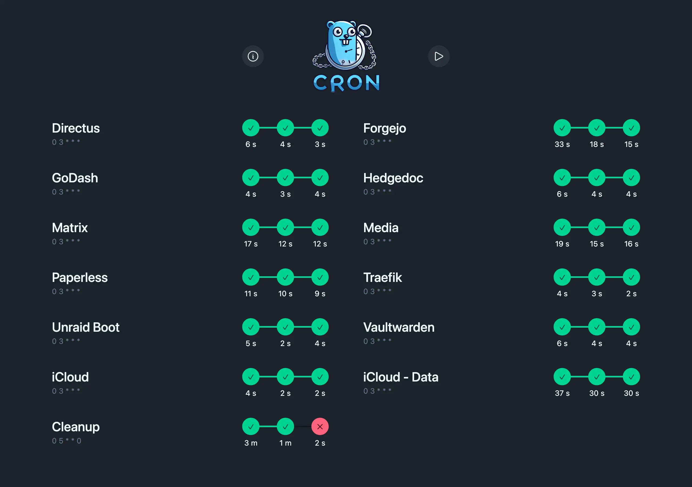
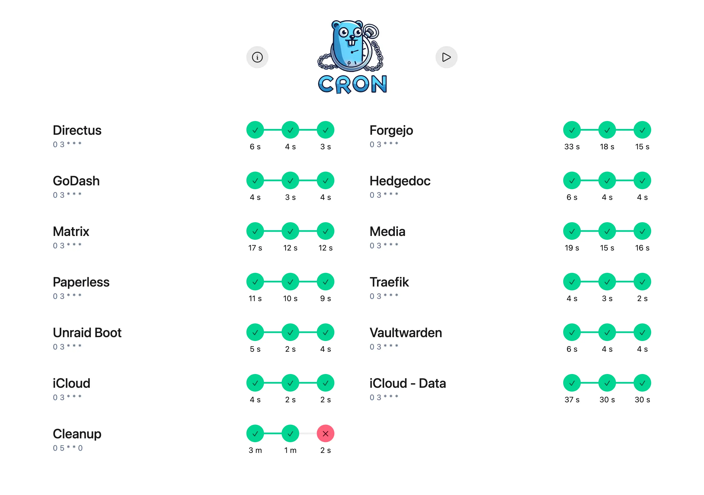
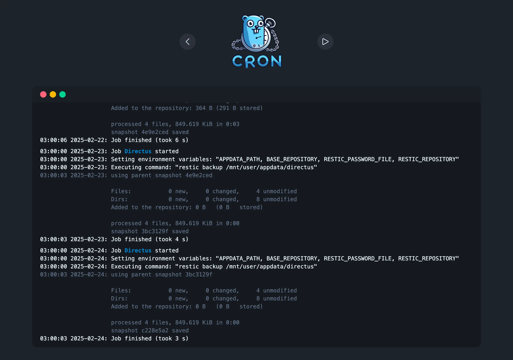
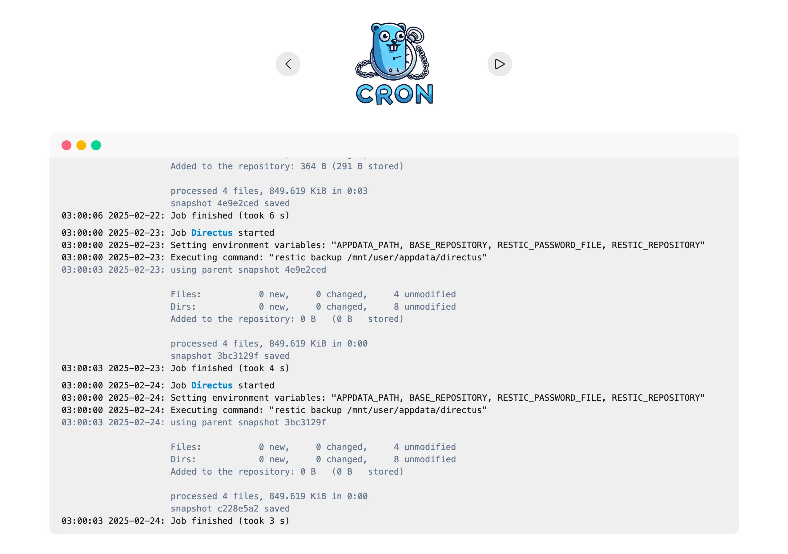
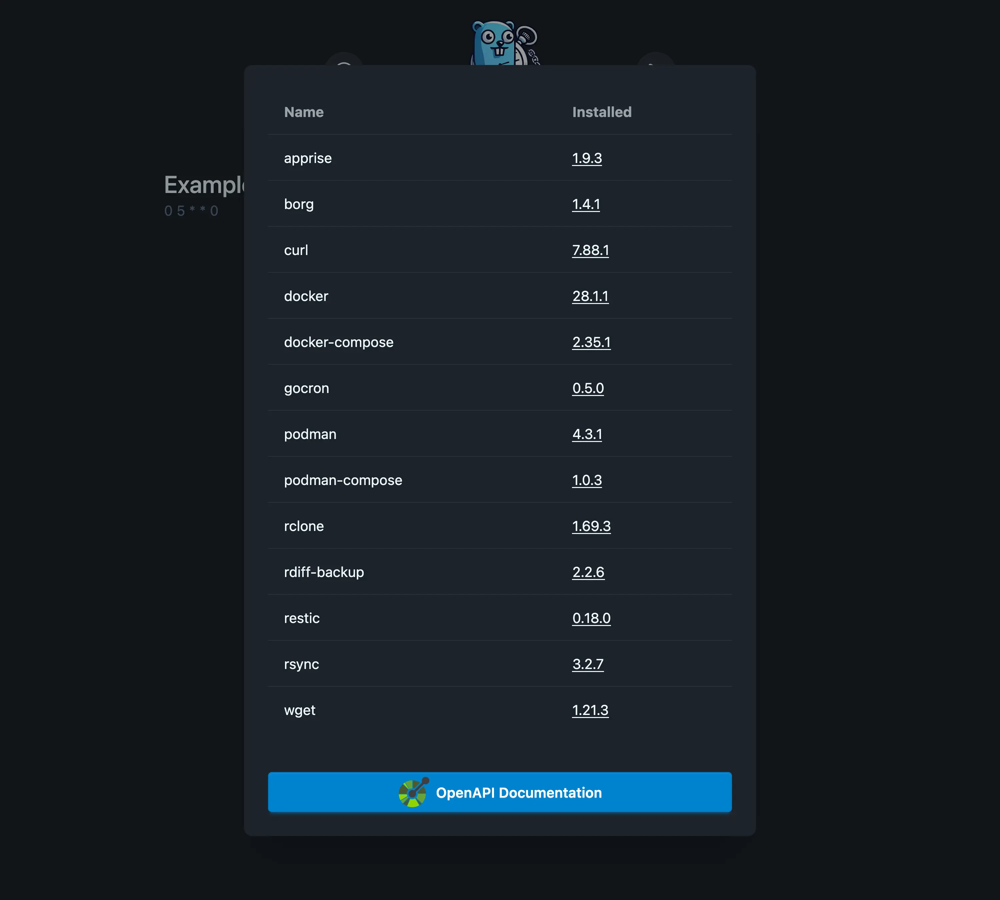
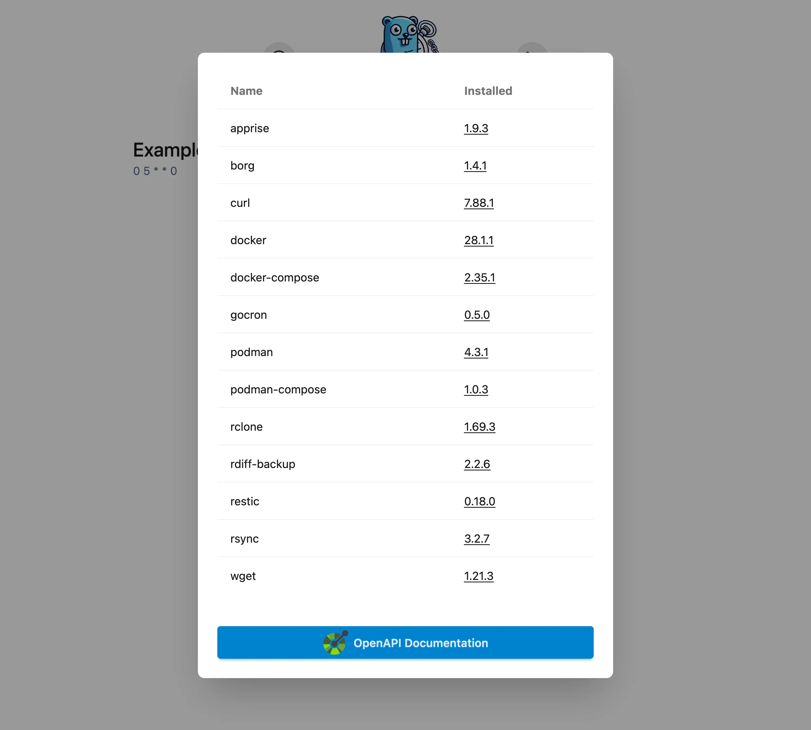
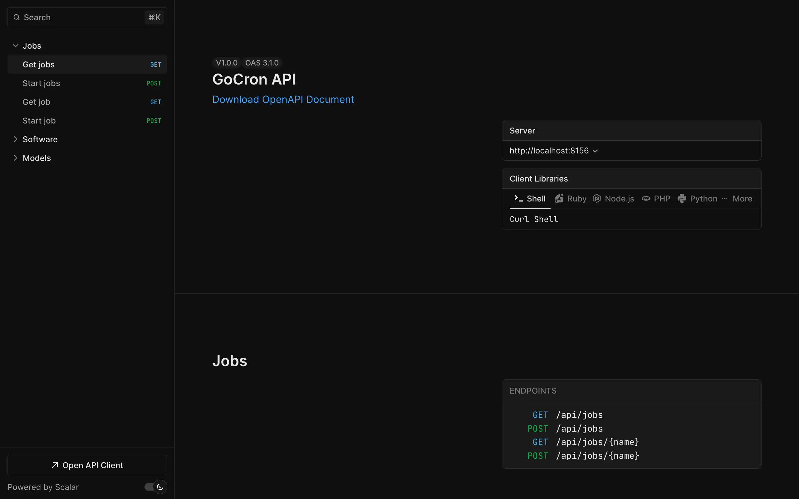
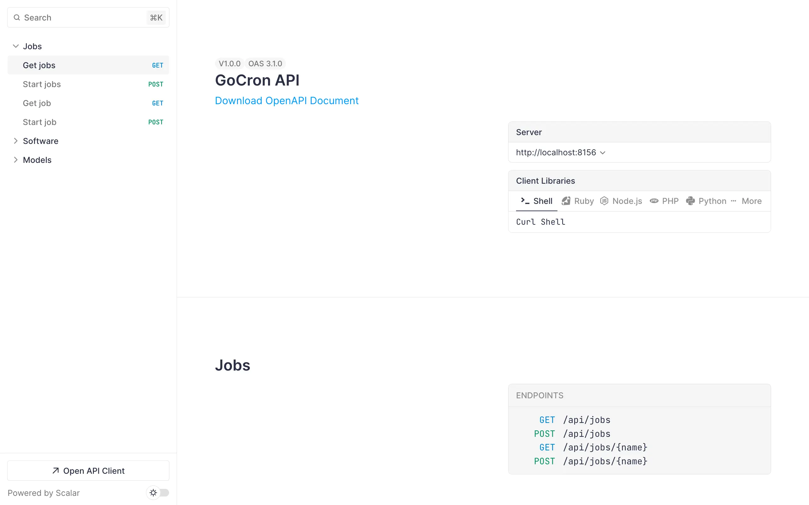

<div align="center">


[](https://github.com/flohoss/gocron/actions/workflows/release.yaml)
[](https://github.com/flohoss/gocron)

A task scheduler built with Go and Vue.js that allows users to specify recurring jobs via a simple YAML configuration file. The scheduler reads job definitions, executes commands at specified times using cron expressions, and passes in environment variables for each job.

</div>

## Table of Contents

- [Table of Contents](#table-of-contents)
- [Features](#features)
- [How It Works](#how-it-works)
- [Docker](#docker)
  - [run command](#run-command)
  - [compose file](#compose-file)
- [Screenshots](#screenshots)
  - [Home](#home)
  - [Job](#job)
  - [Installed software](#installed-software)
  - [OpenAPI Specification (/api/docs)](#openapi-specification-apidocs)
- [Example Configuration](#example-configuration)
- [Preinstalled Software](#preinstalled-software)
- [✨ Star History](#-star-history)
- [License](#license)
- [Development setup](#development-setup)
  - [Automatic rebuild and reload](#automatic-rebuild-and-reload)
  - [Rebuild types](#rebuild-types)

## Features

- Simple Configuration: Easily define jobs, cron schedules, and environment variables in a YAML config file.
- Cron Scheduling: Supports cron expressions for precise scheduling.
- Environment Variables: Define environment variables specific to each job.
- Easy Job Management: Add and remove jobs quickly with simple configuration.
- Pre-installed backup-software for an easy backup solution

## How It Works

- Defaults Section: This section defines default values that are applied to all jobs. You can specify a default cron expression and environment variables to be inherited by each job.
- Jobs Section: Here, you define multiple jobs. Each job can have its own cron expression, environment variables, and commands to execute.
- Environment Variables: Define environment variables for each job to customize its runtime environment.
- Commands: Each job can have multiple commands, which will be executed in sequence.

## Docker

### run command

```sh
docker run -it --rm \
  --name gocron \
  --hostname gocron \
  -p 8156:8156 \
  -e TZ=Europe/Berlin \
  # Delete runs from db after x days, disable with -1
  -e DELETE_RUNS_AFTER_DAYS=7 \
  # Log level can be one of: debug info warn error
  -e LOG_LEVEL=info \
  -e PORT=8156 \
  # Check apprise for supported services (https://github.com/caronc/apprise?tab=readme-ov-file#supported-notifications)
  # -e APPRISE_URL=ntfys://{token}@{hostname}/{topics} \
  # one of: debug info warn error
  # -e APPRISE_NOTIFY_LEVEL=warn \
  -v ./config/:/app/config/ \
  # Uncomment if using Restic with a password file
  # -v ./.resticpwd:/secrets/.resticpwd \
  # Uncomment if using a preconfigured rclone config
  # -v ./.rclone.conf:/root/.config/rclone/rclone.conf \
  # Uncomment to allow running Docker commands inside the container
  # -v /var/run/docker.sock:/var/run/docker.sock \
  ghcr.io/flohoss/gocron:latest
```

### compose file

```yml
services:
  gocron:
    image: ghcr.io/flohoss/gocron:latest
    restart: always
    container_name: gocron
    hostname: gocron
    environment:
      - TZ=Europe/Berlin
      # Delete runs from db after x days, disable with -1
      - DELETE_RUNS_AFTER_DAYS=7
      # Log level can be one of: debug info warn error
      - LOG_LEVEL=info
      - PORT=8156
      # Check apprise for supported services (https://github.com/caronc/apprise?tab=readme-ov-file#supported-notifications)
      # - APPRISE_URL=ntfys://{token}@{hostname}/{topics}
      # one of: debug info warn error
      # - APPRISE_NOTIFY_LEVEL=warn
    volumes:
      - ./config/:/app/config/
      # Uncomment if using Restic with a password file
      # - ./.resticpwd:/secrets/.resticpwd
      # Uncomment if using a preconfigured rclone config
      # - ./.rclone.conf:/root/.config/rclone/rclone.conf
      # Uncomment to allow running Docker commands inside the container
      # - /var/run/docker.sock:/var/run/docker.sock
    ports:
      - '8156:8156'
```

## Screenshots

### Home





### Job





### Installed software





### OpenAPI Specification (/api/docs)





## Example Configuration

I have my own personal backups script inside a git repository.
There you can see a working example that is used every day.

[https://git.unjx.de/flohoss/gocron-config/src/branch/main/config.yml](https://git.unjx.de/flohoss/gocron-config/src/branch/main/config.yml)

## Preinstalled Software

These tools are preinstalled and ready to be used for various operations within your jobs:

1. [BorgBackup](https://www.borgbackup.org/)

> BorgBackup is a fast, secure, and space-efficient backup tool. It deduplicates data and can be used for both local and remote backups. It is widely known for its encryption and compression capabilities, which ensures that backups are both secure and compact.

2. [Restic](https://restic.net/)

> Restic is a fast and secure backup program that supports various backends, including local storage and cloud providers. Restic is optimized for simplicity and speed, offering encrypted backups with minimal configuration. It integrates perfectly with the task scheduler for managing secure backups.

3. [rclone](https://rclone.org/)

> rclone is a command-line program used to manage and transfer files to and from various cloud storage services. It supports numerous cloud providers, including Google Drive, Dropbox, and Amazon S3, making it an excellent choice for managing backups on remote storage solutions. With rclone, you can efficiently sync, move, and manage your data in the cloud.

4. [rsync](https://rsync.samba.org/)

> rsync is a fast and versatile file-copying tool that efficiently synchronizes files and directories between local and remote systems. It uses delta encoding to transfer only changed parts of files, making it an excellent choice for incremental backups and remote file synchronization over SSH.

5. [curl](https://curl.se/)

> curl is a command-line tool for transferring data using various network protocols, including HTTP, HTTPS, FTP, and SFTP. It is widely used for downloading files, interacting with APIs, and automating data transfers in scripts.

6. [wget](https://www.gnu.org/software/wget/)

> wget is a command-line utility for downloading files from the web via HTTP, HTTPS, or FTP.

7. [rdiff-backup](https://rdiff-backup.net/)

> rdiff-backup is an incremental backup tool that efficiently maintains a full backup of the latest data while preserving historical versions in a space-efficient manner. It is ideal for remote and local backups, combining the best features of rsync and traditional incremental backup methods.

8. [apprise](https://github.com/caronc/apprise)

> apprise is a lightweight command-line tool and library for sending notifications to multiple services like Discord, Telegram, email, and more.

Let me know if you’d like any modifications! 🚀

## ✨ Star History

<picture>
  <source media="(prefers-color-scheme: dark)" srcset="https://api.star-history.com/svg?repos=flohoss/gocron&type=Date&theme=dark" />
  <source media="(prefers-color-scheme: light)" srcset="https://api.star-history.com/svg?repos=flohoss/gocron&type=Date" />
  
</picture>

## License

This project is licensed under the MIT License - see the [LICENSE](https://github.com/flohoss/gocron/blob/main/LICENSE) file for details.

## Development setup

### Automatic rebuild and reload

```sh
docker compose up
```

### Rebuild types

```sh
# Run docker compose up first for the types to be generated

docker compose run --rm types
```
