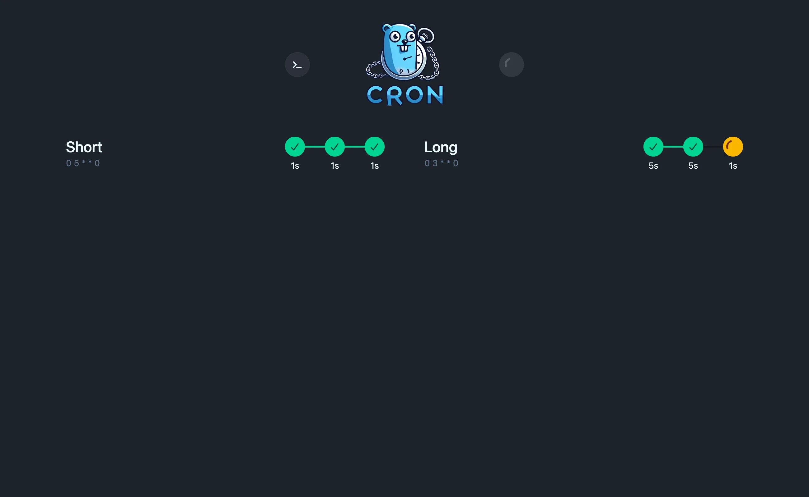
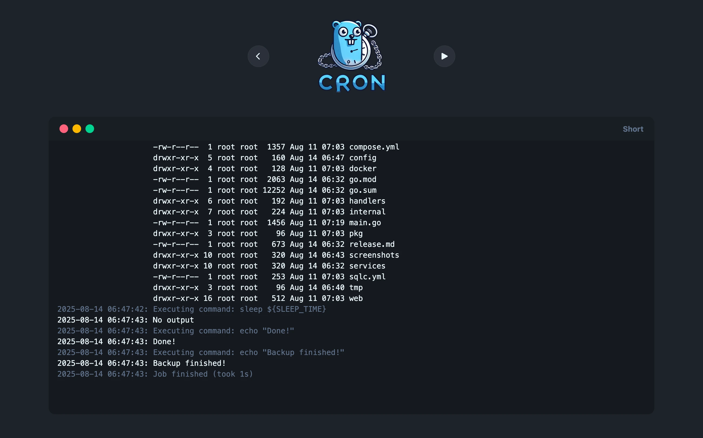
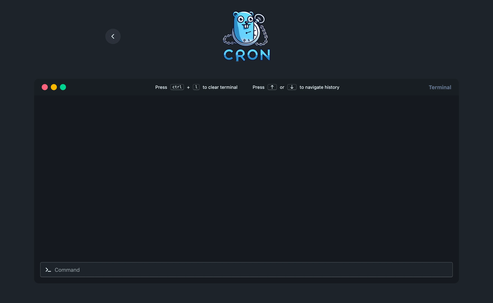
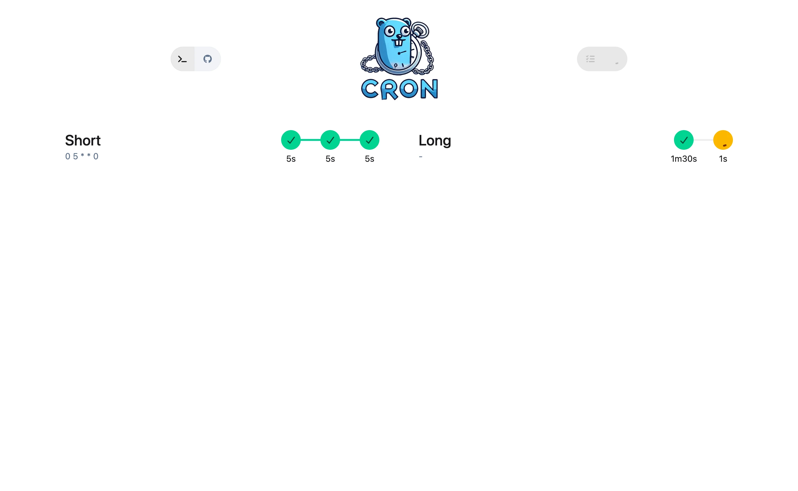
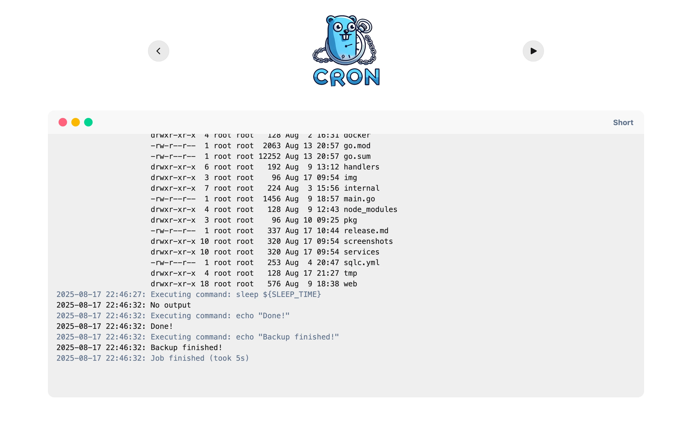
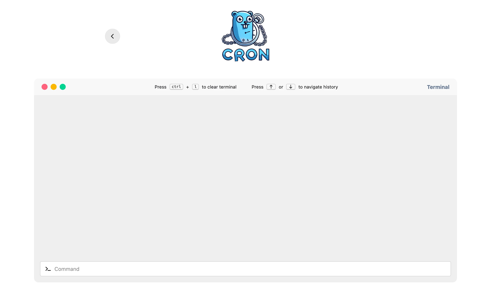
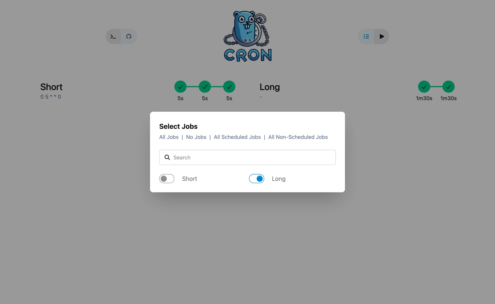
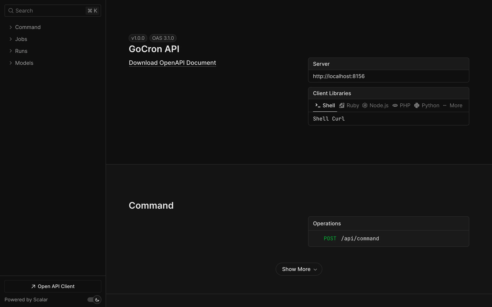
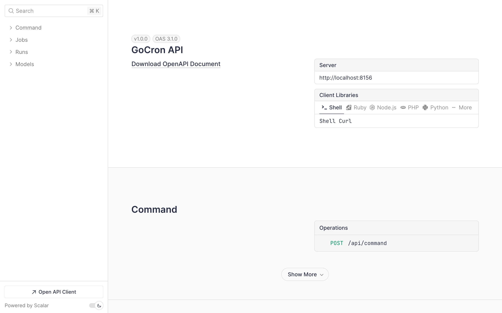

<div align="center">


A task scheduler built with Go and Vue.js that allows users to specify recurring jobs via a simple YAML configuration file. The scheduler reads job definitions, executes commands at specified times using cron expressions, and passes in environment variables for each job.

</div>

## Table of Contents

- [Table of Contents](#table-of-contents)
- [Features](#features)
- [How It Works](#how-it-works)
- [Docker](#docker)
  - [run command](#run-command)
  - [compose file](#compose-file)
- [Screenshots](#screenshots)
  - [Dark mode](#dark-mode)
  - [Light mode](#light-mode)
  - [API Docs](#api-docs)
- [Configuration File](#configuration-file)
  - [YAML Configuration](#yaml-configuration)
  - [Software](#software)
- [Star History](#star-history)
- [License](#license)
- [Development setup](#development-setup)
  - [Automatic rebuild and reload](#automatic-rebuild-and-reload)
  - [Rebuild types](#rebuild-types)

## Features

- Simple Configuration: Easily define jobs, cron schedules, and environment variables in a YAML config file.
- Cron Scheduling: Supports cron expressions for precise scheduling.
- Environment Variables: Define environment variables specific to each job.
- Easy Job Management: Add and remove jobs quickly with simple configuration.
- Pre-installed backup-software for an easy backup solution

## How It Works

- Defaults Section: This section defines default values that are applied to all jobs. You can specify a default cron expression and environment variables to be inherited by each job.
- Jobs Section: Here, you define multiple jobs. Each job can have its own cron expression, environment variables, and commands to execute.
- Environment Variables: Define environment variables for each job to customize its runtime environment.
- Commands: Each job can have multiple commands, which will be executed in sequence.

## Docker

### run command

```sh
docker run -it --rm \
  --name gocron \
  --hostname gocron \
  -p 8156:8156 \
  -v ./config/:/app/config/ \
  ghcr.io/flohoss/gocron:latest
```

### compose file

```yml
services:
  gocron:
    image: ghcr.io/flohoss/gocron:latest
    restart: always
    container_name: gocron
    hostname: gocron
    volumes:
      - ./config/:/app/config/
    ports:
      - '8156:8156'
```

## Screenshots

### Dark mode

<p align="center">
  
  
  
  
</p>

### Light mode

<p align="center">
  
  
  
  
</p>

### API Docs

<p align="center">
  
  
</p>

## Configuration File

### YAML Configuration

The entire configuration is managed via the YAML file, including settings for the timezone, logging, and server.

For a complete and working configuration example, please refer to the [`config.yaml`](/config/config.yaml) file in the repository.

### Software

You can specify the software you want to install and the version you want to use directly in the configuration file.
Available software packages include: apprise, borgbackup, docker, git, podman, rclone, rdiff-backup, restic, rsync, logrotate, sqlite3, and kopia.

The version format depends on the installation method:

- **apprise** (via pipx): version format like `1.2.0`
- **docker** (via apt): version format like `5:24.0.5-1~debian.11~bullseye`
- **Others** (via apt): standard apt version format

Here is an example of how to set up specific software versions:

```yaml
software:
  - name: 'apprise'
    version: '1.2.0'
  - name: 'borgbackup'
    version: '1.2.0'
  - name: 'docker'
    version: '5:24.0.5-1~debian.11~bullseye'
  - name: 'git'
  - name: 'podman'
  - name: 'rclone'
  - name: 'rdiff-backup'
  - name: 'restic'
    version: '0.14.0'
  - name: 'rsync'
  - name: 'logrotate'
  - name: 'sqlite3'
  - name: 'kopia'
```

## Star History

<picture>
  <source media="(prefers-color-scheme: dark)" srcset="https://api.star-history.com/svg?repos=flohoss/gocron&type=Date&theme=dark" />
  <source media="(prefers-color-scheme: light)" srcset="https://api.star-history.com/svg?repos=flohoss/gocron&type=Date" />
  
</picture>

## License

This project is licensed under the MIT License - see the [LICENSE](https://github.com/flohoss/gocron/blob/main/LICENSE) file for details.

## Development setup

### Update Dependencies

```bash
# Node packages
docker compose run --rm frontend yarn upgrade --latest

# Go packages
docker compose run --rm app go get -u && go mod tidy
```

### Automatic rebuild and reload

```sh
docker compose up
```

### Rebuild types

```sh
# Run docker compose up first for the types to be generated

docker compose run --rm types
```
