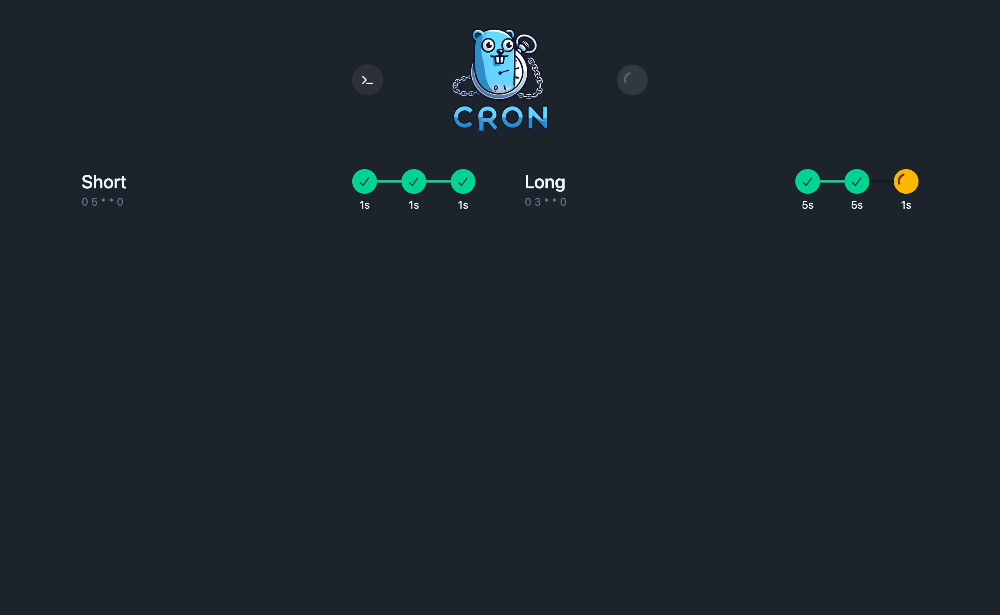
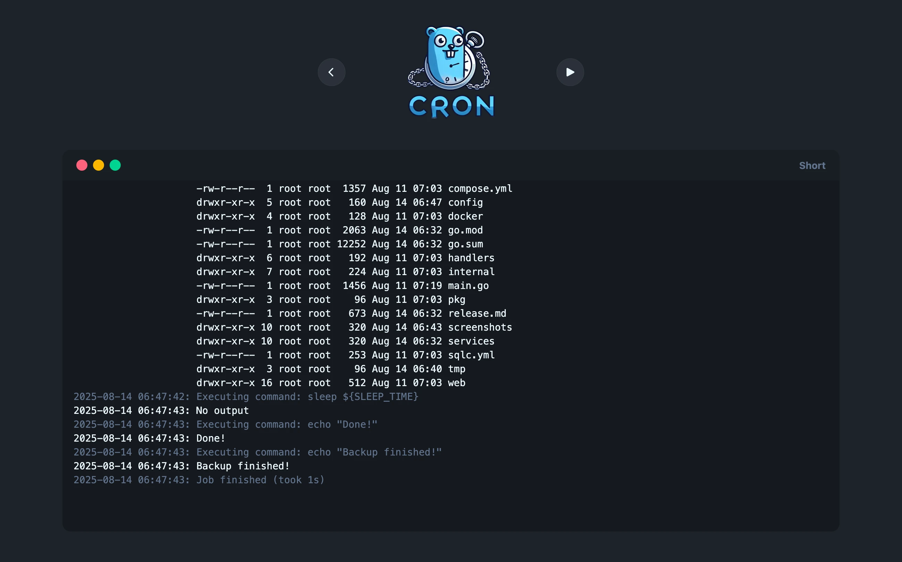
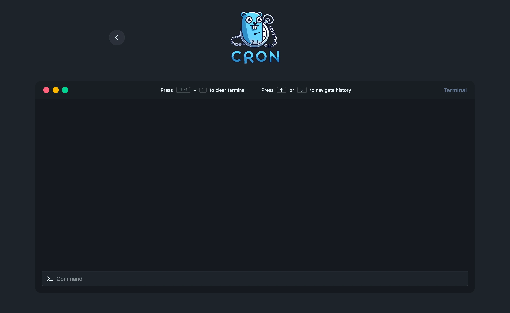
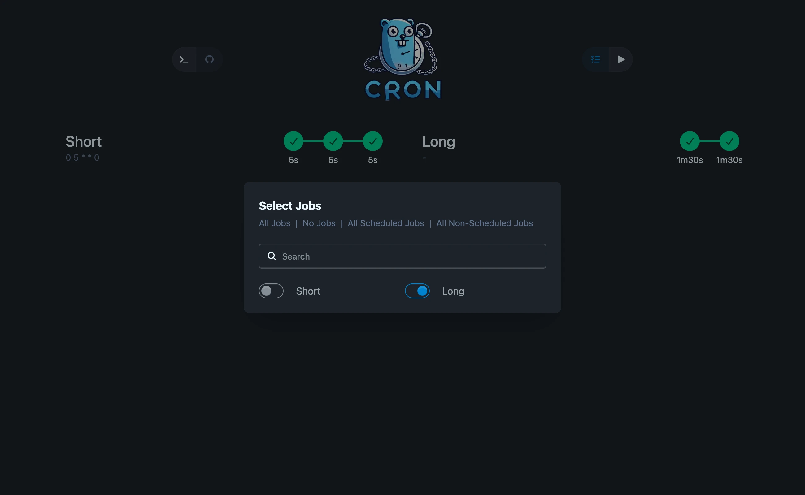
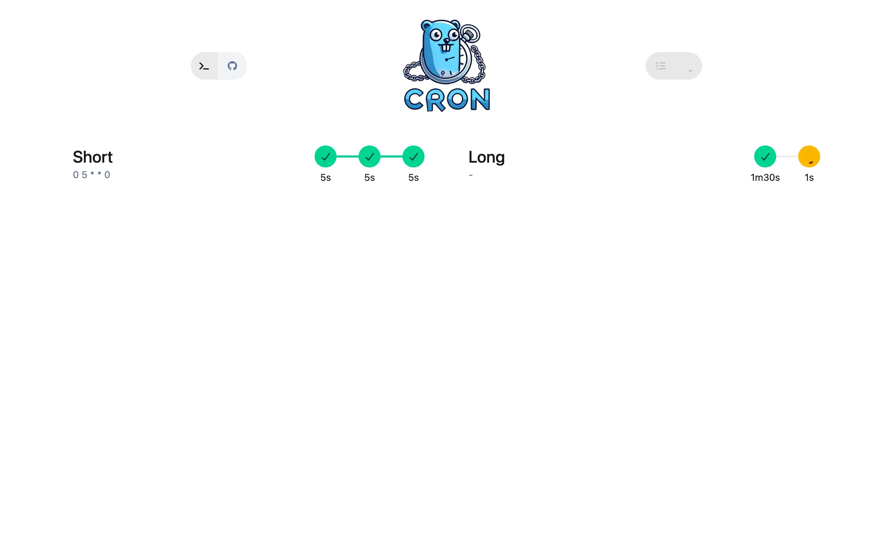
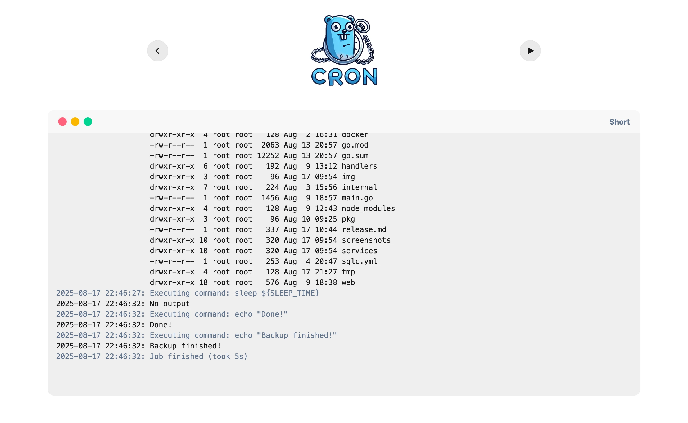
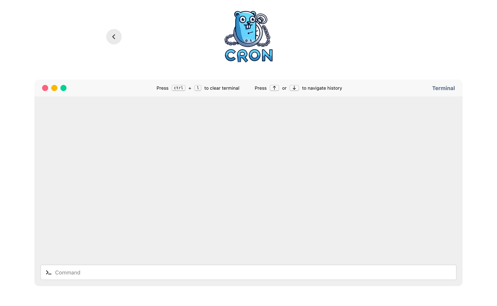
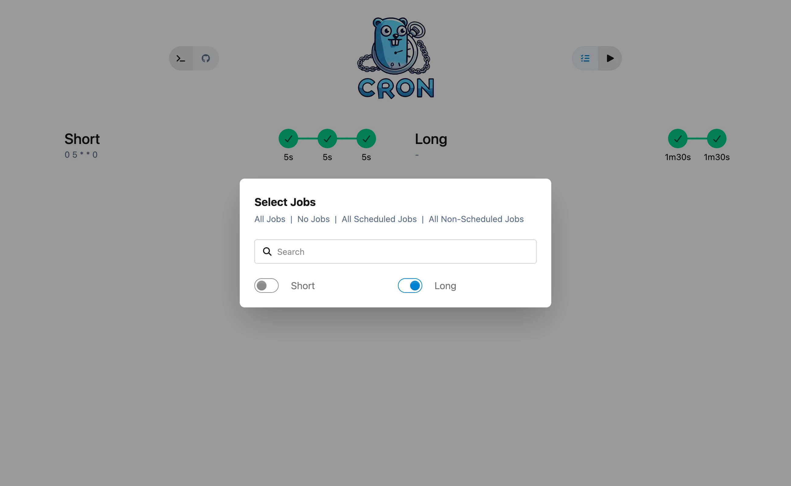
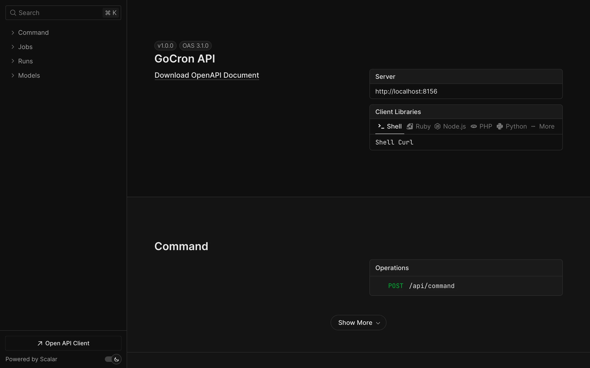
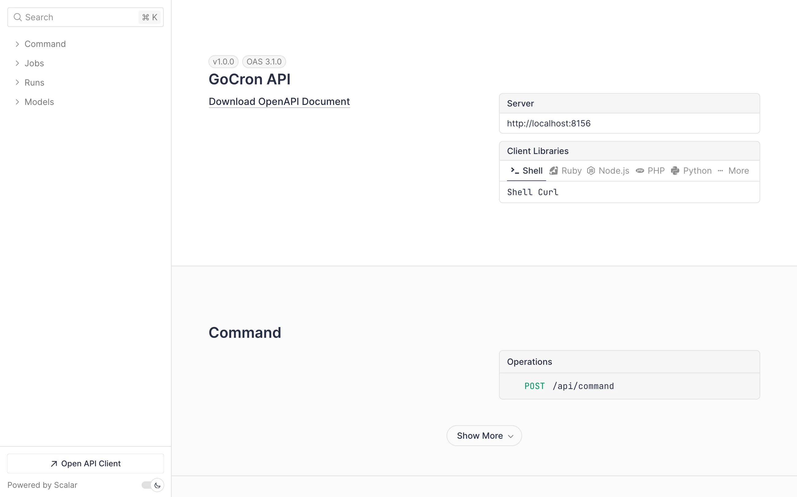

<div align="center">


[](https://github.com/flohoss/gocron/actions/workflows/ci.yaml)
[](https://github.com/flohoss/gocron/wiki/coverage.html)

[](https://reporanker.com/repos/flohoss/gocron)

A self-hosted task scheduler built with Go and Vue.js. Define recurring jobs in a YAML file, run them on cron schedules, pass per-job environment variables, and manage everything through a web UI backed by SQLite.

</div>

## Table of Contents

- [Quick Start](#quick-start)
  - [NixOS](#nixos)
- [Features](#features)
- [Configuration](#configuration)
  - [Job defaults](#job-defaults)
  - [Jobs](#jobs)
  - [Software](#software)
  - [Environment overrides](#environment-overrides-gc_)
  - [Database location](#database-location)
- [Failure semantics](#failure-semantics)
- [Safety & security](#safety--security)
- [Screenshots](#screenshots)
- [Development](#development)
- [Star History](#star-history)
- [License](#license)

## Quick Start

Just run the container — GoCron creates a default config with example jobs on first start if none exists:

```sh
docker run -it --rm \
  --name gocron \
  -p 8156:8156 \
  -v ./config/:/app/config/ \
  ghcr.io/flohoss/gocron:latest
```

Open <http://localhost:8156> to view your jobs, trigger runs manually, and inspect logs. Edit `./config/config.yaml` to add your own jobs — changes are picked up automatically (no restart needed).

Or with Docker Compose:

```yml
services:
  gocron:
    image: ghcr.io/flohoss/gocron:latest
    restart: always
    ports:
      - '8156:8156'
    volumes:
      - ./config/:/app/config/
```

Tagged GitHub releases also include downloadable Linux binaries. Run `./gocron_<version>_linux_<arch> --version` to inspect the embedded version metadata.

### NixOS

GoCron is packaged in nixpkgs with a NixOS module. Enable the service and point it at a config file:

```nix
services.gocron = {
  enable = true;
  openFirewall = true;
  settings = {
    time_zone = "UTC";
    job_defaults.cron = "0 3 * * 0";
    jobs = [{
      name = "Hello World";
      commands = [ ''echo "Hello from GoCron"'' ];
    }];
  };
};
```

See the [package](https://search.nixos.org/packages?query=gocron) and [module options](https://search.nixos.org/options?query=gocron) on search.nixos.org for the full list of settings.

## Features

- **YAML-driven** — define jobs, cron schedules, and environment variables in one file.
- **Cron scheduling** — standard 5-field cron expressions.
- **Per-job environment variables** — each job gets its own env, with `${VAR}` expansion in commands. Job-specific values override defaults with the same key.
- **Default inheritance** — jobs inherit a default cron, timeout, retries, env vars, and pre/post commands from `job_defaults`.
- **Web UI** — view jobs, trigger runs, read logs, and use a sandboxed terminal (dark/light mode).
- **SQLite state** — run history and logs persist in a local SQLite database.
- **Health checks** — HTTP callbacks at job start, end, and failure for alerting.
- **Pre-installed backup tools** — optionally install restic, borgbackup, rclone, and more.

## Configuration

GoCron reads `./config/config.yaml` by default. Override the path with `--config /path/to/config.yaml`. The full reference config is [`config/config.yaml`](config/config.yaml).

```yaml
time_zone: 'UTC' # Sets the TZ environment variable for the process
log_level: 'info' # debug | info | warn | error | off
delete_runs_after_days: 7 # Delete run history after N days (0 = keep forever)
db:
  location: '.' # Absolute, or relative to the config file
  name: 'db.sqlite'

server:
  address: '0.0.0.0'
  port: 8156

job_defaults:
  cron: '0 3 * * 0' # Inherited by jobs without their own cron
  # timeout: '30s'                # Optional: inherited by jobs without their own timeout
  # retries: 2                    # Optional: inherited by jobs without their own retries
  envs:
    - key: SLEEP_TIME
      value: '5'
  pre_commands:
    - echo "Starting backup..."
  post_commands:
    - echo "Backup finished!"

jobs:
  - name: 'Nightly Backup'
    cron: '0 5 * * 0' # Overrides job_defaults.cron
    timeout: '30s' # Abort a single command after this duration
    retries: 2 # Retry each failing command up to N times
    disable_fail_fast: false # Stop on first failing command (default)
    envs:
      - key: RESTIC_REPOSITORY
        value: '/backups/nightly'
    commands:
      - restic backup /data
      - restic forget --keep-daily 7
```

### Job defaults

The `job_defaults` block defines values inherited by every job that doesn't override them:

| Field           | Required | Description                                                      |
| --------------- | -------- | ---------------------------------------------------------------- |
| `cron`          | no       | Default cron expression for jobs without one.                    |
| `timeout`       | no       | Abort any single command after this duration (e.g. `30s`, `5m`). |
| `retries`       | no       | Retry each failing command up to N additional times.             |
| `envs`          | no       | Environment variables applied to every job.                      |
| `pre_commands`  | no       | Commands run once before the job's own commands.                 |
| `post_commands` | no       | Commands run once after the job's commands.                      |

### Jobs

Each job in the `jobs` list runs its `commands` in sequence:

| Field               | Required | Description                                                                                                                     |
| ------------------- | -------- | ------------------------------------------------------------------------------------------------------------------------------- |
| `name`              | yes      | Human-readable job name (shown in the UI).                                                                                      |
| `cron`              | no       | Cron expression. Overrides `job_defaults.cron`. If neither is set, the job is manual-only (equivalent to `disable_cron: true`). |
| `disable_cron`      | no       | If `true`, the job only runs when triggered manually.                                                                           |
| `timeout`           | no       | Per-command timeout. Overrides `job_defaults.timeout`.                                                                          |
| `retries`           | no       | Per-command retry count. Overrides `job_defaults.retries`.                                                                      |
| `disable_fail_fast` | no       | If `true`, continue remaining commands after a failure. Default `false`.                                                        |
| `envs`              | no       | Per-job environment variables. Merged with `job_defaults.envs` — job-specific values override defaults with the same key.       |
| `commands`          | yes      | Shell commands executed in order.                                                                                               |

Each command runs through `sh -c`, so you can use pipes, redirects, and shell features directly — no need to wrap commands in `sh -c '...'` yourself:

```yaml
commands:
  - echo "hello" | wc -l
  - echo "to stderr" >&2
  - if [ -f /data/backup.lock ]; then echo "locked"; exit 1; fi
```

For multi-line scripts, use YAML block scalars:

```yaml
commands:
  - |
    if [ -f /data/backup.lock ]; then
      echo "locked"
      exit 1
    fi
    echo "proceeding"
```

### Software

You can install common backup and container tools directly in the image. Available packages: `apprise`, `borgbackup`, `docker`, `git`, `podman`, `rclone`, `rdiff-backup`, `restic`, `rsync`, `logrotate`, `sqlite3`, and `kopia`.

Recreate the container for changes to take effect.

```yaml
software:
  - name: 'restic'
    version: '0.14.0'
  - name: 'git'
  - name: 'rsync'
```

Version formats depend on the installation method:

- **apprise** (via pipx): e.g. `1.2.0`
- **docker** (via apt): e.g. `5:24.0.5-1~debian.11~bullseye`
- **Others** (via apt): standard apt version format

### Environment overrides (`GC_`)

Any config value can be overridden via an environment variable with the `GC_` prefix. Dots become underscores and keys are uppercased.

- `GC_LOG_LEVEL=debug` overrides `log_level`
- `GC_SERVER_PORT=9000` overrides `server.port`
- `GC_HEALTHCHECK_TYPE=GET` overrides `healthcheck.type`

### Database location

SQLite data is stored next to the config file by default. Override with `db.location` (absolute, or relative to the config file) and `db.name` (default `db.sqlite`).

## Failure semantics

Because GoCron executes shell commands on a schedule, it's important to understand how it handles failures, overlaps, and shutdowns.

### Concurrency and overlapping runs

GoCron is **single-flight**: while any job is running, no other job will start. Scheduled runs that arrive while a job is active are **skipped**, not queued. If you need parallel jobs, run multiple GoCron instances with separate config files.

### Missed schedules

GoCron uses standard cron semantics. If the container is down when a schedule fires, that run is **not** caught up on restart. There is no `@reboot` or missed-run replay.

### Time zones and DST

Set `time_zone` in the config (it sets the `TZ` environment variable). All schedules run in that timezone. During a DST "spring forward" gap, a cron expression targeting the skipped hour will not fire. During "fall back", a target in the repeated hour may fire once or twice. Test schedules around DST transitions.

### Command timeouts

Set a per-job `timeout` (e.g. `30s`, `5m`) to abort any single command that runs longer than the given duration. A timed-out command counts as a failure. A `timeout` in `job_defaults` is inherited by jobs that don't set their own. If neither is set, commands run without a deadline.

### Retries

Set `retries` on a job to retry each failing command up to N additional times (N+1 total attempts). Retries apply **per-command**, not per-job, and are immediate (no backoff). A `retries` value in `job_defaults` is inherited by jobs that don't set their own.

### Fail-fast behavior

- `disable_fail_fast: false` (default) stops the job on the first failing command.
- `disable_fail_fast: true` continues running remaining commands even if one fails. The run is still marked as failed.

### Graceful shutdown

On `SIGTERM` or `SIGINT` (e.g. `docker stop` or `Ctrl+C`), GoCron:

1. Stops the scheduler — no new jobs start.
2. Cancels any running command — the command's process group receives `SIGKILL`.
3. Marks the interrupted run as **Canceled** in the database.

If the container is killed hard (`SIGKILL`, OOM, power loss), the graceful path doesn't run. On the next startup, any run still marked as `Running` is reset to `Canceled` automatically.

### Log retention

`delete_runs_after_days` controls how long run history (logs, exit status) is kept in SQLite. Set to `0` to retain forever. A daily cleanup job runs at midnight to prune old records.

### Failure notifications

Configure the `healthcheck` section to send HTTP callbacks at three phases: `start`, `end`, and `failure`. Each phase supports a URL, query params, and a JSON body. This is designed for [Gatus external endpoints with heartbeat](https://gatus.io/docs/monitoring-push-based) — Gatus marks the endpoint unhealthy if it stops receiving pings, so you're alerted both when a job fails and when it doesn't run at all.

```yaml
healthcheck:
  type: 'POST'
  authorization: 'Bearer token'
  start:
    url: https://twin.sh/health/api/v1/endpoints/backups_nightly/external
    params:
      success: true
  end:
    url: https://twin.sh/health/api/v1/endpoints/backups_nightly/external
    params:
      success: true
  failure:
    url: https://twin.sh/health/api/v1/endpoints/backups_nightly/external
    params:
      success: false
      error: 'Backup failed'
```

Alternatively, install `apprise` via the `software` list to push notifications from within a command.

## Safety & security

### Trust boundaries and permissions

- Commands run inside the container as the process user (root by default in the published image). Use the least-privileged user for jobs that touch sensitive data.
- The web UI terminal is gated by an allow-list (`terminal.allowed_commands` in the config). Do **not** set `allow_all_commands: true` in production.
- The working directory is the container's `/app`. Mount only the directories a job needs.

### Secrets

Do not store passwords, API tokens, or repository credentials in plaintext inside `config.yaml` or `envs` blocks. Prefer one of:

- **Docker secrets / Compose secrets** — mount a secrets file and reference it from the command, e.g. `restic -r $(cat /run/secrets/repo) backup /data`.
- **Environment files** — pass sensitive values via `docker run --env-file` or `environment:` in Compose, and reference them with `${VAR}` expansion in commands.

### Supply-chain considerations

Pre-installing backup tools (`restic`, `borgbackup`, `docker`, `podman`, etc.) increases the image's attack surface. Only list the software you actually need in the `software` section, and pin versions explicitly to avoid surprise upgrades on image rebuild.

## Screenshots

### Dark mode

<p align="center">
  
  
  
  
</p>

### Light mode

<p align="center">
  
  
  
  
</p>

### API Docs

<p align="center">
  
  
</p>

## Development

### Run tests

```bash
# Go tests
docker compose run --rm go test ./...

# E2E tests (uses a separate e2e config via compose override)
docker compose -f compose.yml -f compose.e2e.yml --profile test run --rm e2e
docker compose -f compose.yml -f compose.e2e.yml --profile test down
```

### Update dependencies

```bash
# Node packages
docker compose run --rm npm install
docker compose run --rm --entrypoint npx npm npm-check-updates -u && docker compose run --rm npm install

# E2E packages
docker compose run --rm npm-e2e install
docker compose run --rm --entrypoint npx npm-e2e npm-check-updates -u && docker compose run --rm npm install

# Go packages
docker compose run --rm go get -u ./...
docker compose run --rm go mod tidy
```

### Automatic rebuild and reload

```sh
docker compose up
```

## Star History

<picture>
  <source media="(prefers-color-scheme: dark)" srcset="https://api.star-history.com/svg?repos=flohoss/gocron&type=Date&theme=dark" />
  <source media="(prefers-color-scheme: light)" srcset="https://api.star-history.com/svg?repos=flohoss/gocron&type=Date" />
  
</picture>

## License

This project is licensed under the MIT License — see the [LICENSE](LICENSE) file for details.
