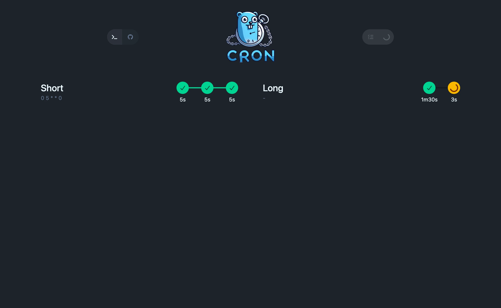
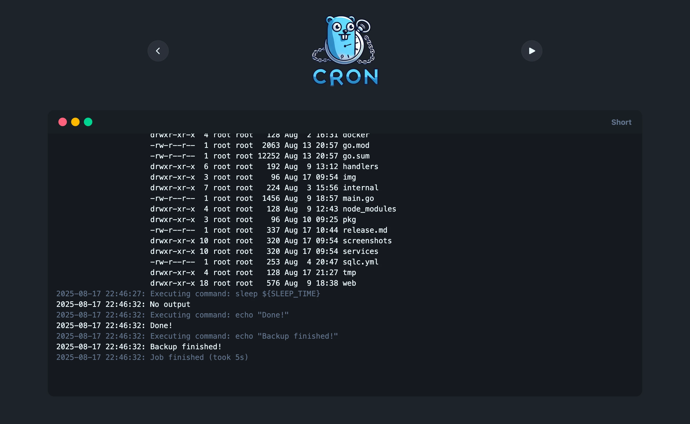
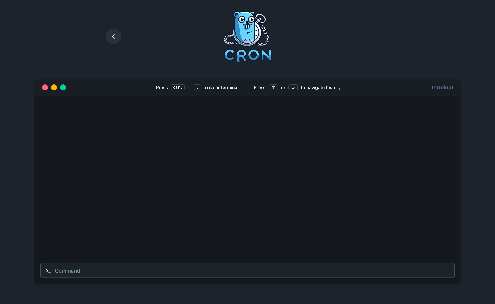
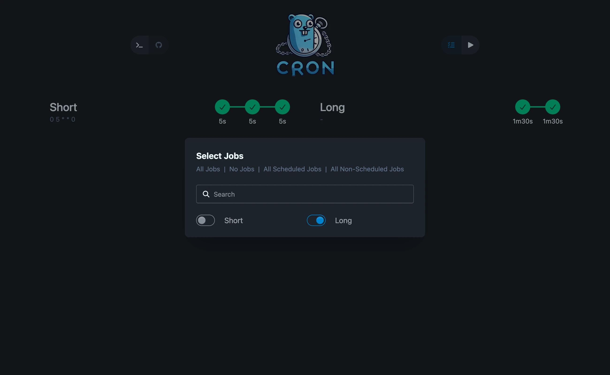
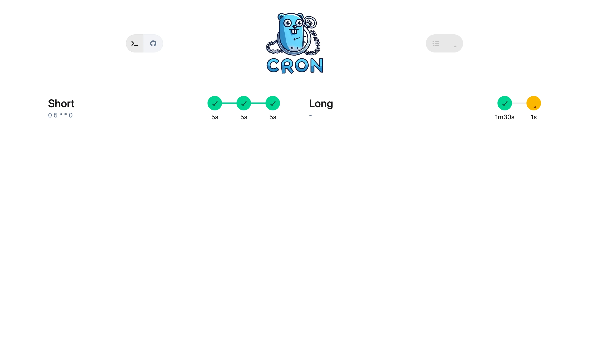
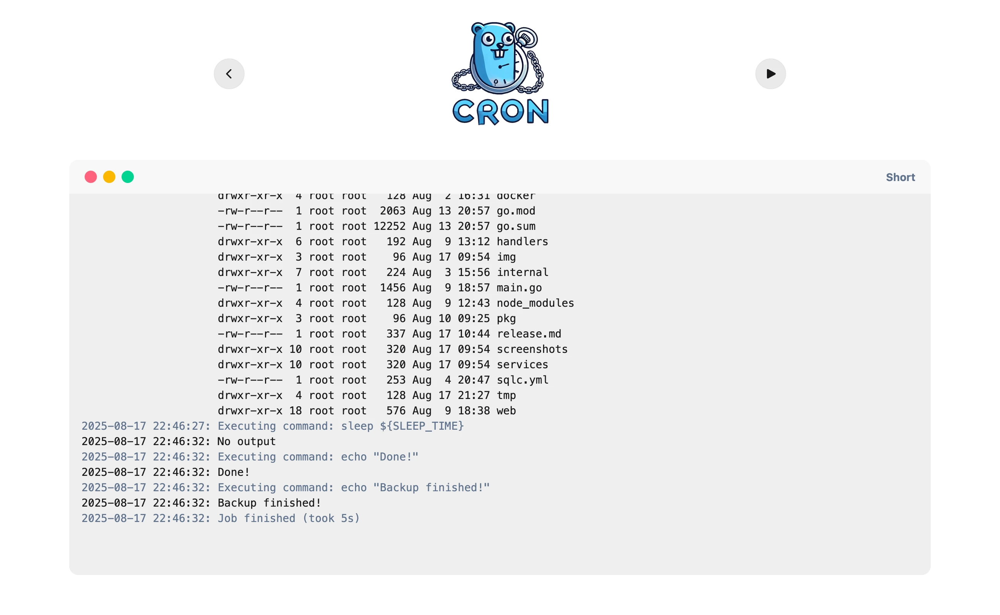
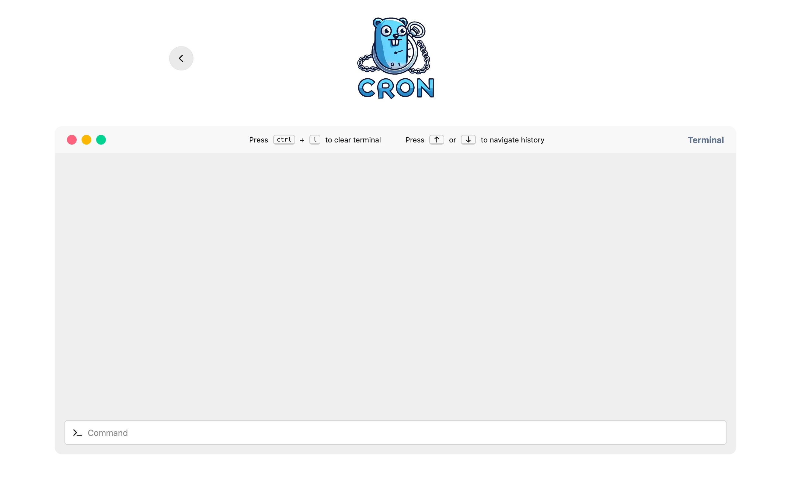
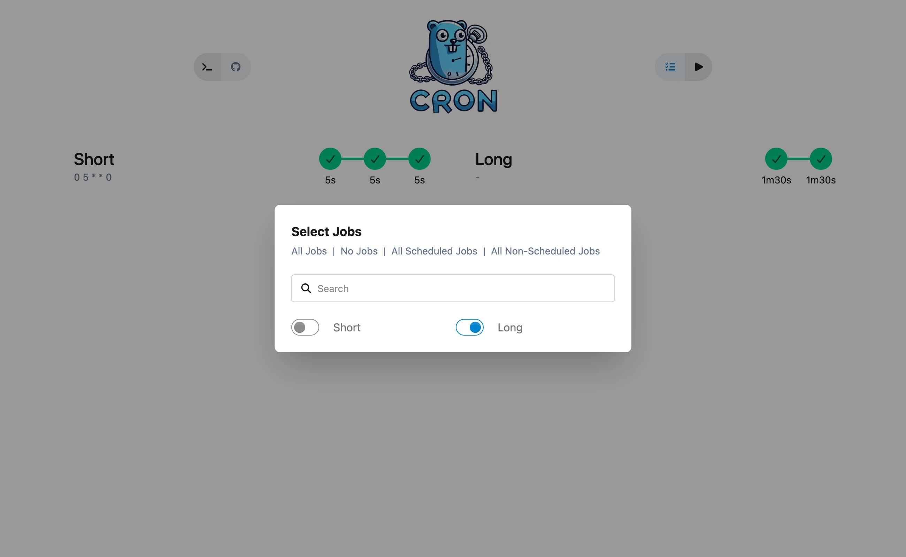
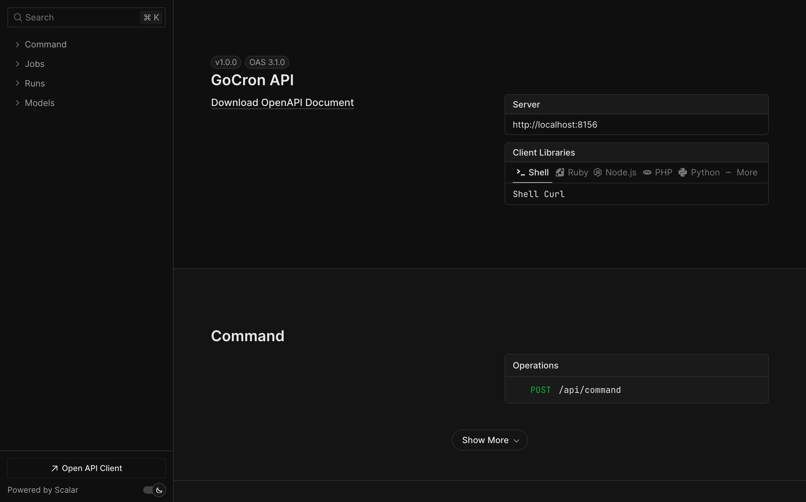
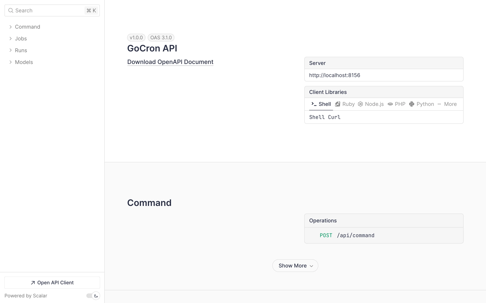

<div align="center">


[](https://github.com/flohoss/gocron/actions/workflows/ci.yaml)
[](https://github.com/flohoss/gocron/actions/workflows/ci.yaml)

[](https://reporanker.com/repos/flohoss/gocron)

A self-hosted task scheduler built with Go and Vue.js. Define recurring jobs in a YAML file, run them on cron schedules, pass per-job environment variables, and manage everything through a web UI backed by SQLite.

</div>

## Table of Contents

- [Quick Start](#quick-start)
  - [NixOS](#nixos)
- [Features](#features)
- [Configuration](#configuration)
  - [Job defaults](#job-defaults)
  - [Jobs](#jobs)
  - [Software](#software)
  - [Environment overrides](#environment-overrides-gc_)
  - [Configuration reloads](#configuration-reloads)
  - [Database location](#database-location)
  - [Single sign-on (OIDC)](#single-sign-on-oidc)
- [Failure semantics](#failure-semantics)
- [Safety & security](#safety--security)
- [Screenshots](#screenshots)
- [Development](#development)
- [License](#license)

## Quick Start

Just run the container — GoCron creates a default config with example jobs on first start if none exists:

```sh
docker run -it --rm \
  --name gocron \
  -p 8156:8156 \
  -v ./config/:/app/config/ \
  ghcr.io/flohoss/gocron:latest
```

Open <http://localhost:8156> to view your jobs, trigger runs manually, and inspect logs. Edit `./config/config.yaml` to add your own jobs — changes are picked up automatically (no restart needed).

Or with Docker Compose:

```yml
services:
  gocron:
    image: ghcr.io/flohoss/gocron:latest
    restart: always
    ports:
      - '8156:8156'
    volumes:
      - ./config/:/app/config/
```

Tagged GitHub releases also include downloadable Linux binaries. Run `./gocron_<version>_linux_<arch> --version` to inspect the embedded version metadata.

### NixOS

GoCron is packaged in nixpkgs with a NixOS module. Enable the service and point it at a config file:

```nix
services.gocron = {
  enable = true;
  openFirewall = true;
  settings = {
    time_zone = "UTC";
    job_defaults.cron = "0 3 * * 0";
    jobs = [{
      name = "Hello World";
      commands = [ ''echo "Hello from GoCron"'' ];
    }];
  };
};
```

See the [package](https://search.nixos.org/packages?query=gocron) and [module options](https://search.nixos.org/options?query=gocron) on search.nixos.org for the full list of settings.

## Features

- **YAML-driven** — define jobs, cron schedules, and environment variables in one file.
- **Cron scheduling** — standard 5-field cron expressions.
- **Per-job environment variables** — each job gets its own env, with `${VAR}` expansion in commands. Job-specific values override defaults with the same key.
- **Default inheritance** — jobs inherit a default cron, timeout, retries, env vars, and pre/post commands from `job_defaults`.
- **Web UI** — view jobs, trigger runs, read logs, and use a sandboxed terminal (dark/light mode).
- **SQLite state** — run history and logs persist in a local SQLite database.
- **Health checks** — HTTP callbacks at job start, end, and failure for alerting.
- **Pre-installed backup tools** — optionally install restic, borgbackup, rclone, and more.
- **Reverse proxy support** — trust `X-Forwarded-For` from configured proxies for accurate client IPs.
- **Rate limiting & CORS** — optional per-IP request limits and configurable allowed origins.
- **Live updates** — job runs stream over Server-Sent Events without polling.
- **Single sign-on** — optional OIDC login for the UI and API. See [Single sign-on (OIDC)](#single-sign-on-oidc).

## Configuration

GoCron reads `./config/config.yaml` by default. Override the path with `--config /path/to/config.yaml`. On first boot the file is created automatically from [`config/config.example.yaml`](config/config.example.yaml) — the commented reference config — ready for you to adjust.

```yaml
time_zone: 'UTC' # All schedules run in this time zone (applied on config reload)
log_level: 'info' # debug | info | warn | error
delete_runs_after_days: 7 # Delete run history after N days (0 = keep forever)
db:
  location: '.' # Absolute, or relative to the config file
  name: 'db.sqlite'

server:
  address: '0.0.0.0'
  port: 8156
  # Set when behind a reverse proxy so the real client IP is used
  # trusted_proxies: ['10.0.0.0/8']
  # cors:
  #   allow_origins: ['https://gocron.example.com'] # Defaults to '*'
  # rate_limit: # Disabled by default
  #   enabled: true
  #   rate: 20 # Requests per second per client IP
  #   burst: 40

job_defaults:
  cron: '0 3 * * 0' # Inherited by jobs without their own cron
  # timeout: '30s'                # Optional: inherited by jobs without their own timeout
  # retries: 2                    # Optional: inherited by jobs without their own retries
  envs:
    - key: SLEEP_TIME
      value: '5'
  pre_commands:
    - echo "Starting backup..."
  post_commands:
    - echo "Backup finished!"

jobs:
  - name: 'Nightly Backup'
    cron: '0 5 * * 0' # Overrides job_defaults.cron
    timeout: '30s' # Abort a single command after this duration
    retries: 2 # Retry each failing command up to N times
    disable_fail_fast: false # Stop on first failing command (default)
    envs:
      - key: RESTIC_REPOSITORY
        value: '/backups/nightly'
    commands:
      - restic backup /data
      - restic forget --keep-daily 7
```

### Job defaults

The `job_defaults` block defines values inherited by every job that doesn't override them:

| Field           | Required | Description                                                      |
| --------------- | -------- | ---------------------------------------------------------------- |
| `cron`          | no       | Default cron expression for jobs without one.                    |
| `timeout`       | no       | Abort any single command after this duration (e.g. `30s`, `5m`). |
| `retries`       | no       | Retry each failing command up to N additional times.             |
| `envs`          | no       | Environment variables applied to every job.                      |
| `pre_commands`  | no       | Commands run once before the job's own commands.                 |
| `post_commands` | no       | Commands run once after the job's commands.                      |

### Jobs

Each job in the `jobs` list runs its `commands` in sequence:

| Field               | Required | Description                                                                                                                     |
| ------------------- | -------- | ------------------------------------------------------------------------------------------------------------------------------- |
| `name`              | yes      | Human-readable job name (shown in the UI).                                                                                      |
| `cron`              | no       | Cron expression. Overrides `job_defaults.cron`. If neither is set, the job is manual-only (equivalent to `disable_cron: true`). |
| `disable_cron`      | no       | If `true`, the job only runs when triggered manually.                                                                           |
| `timeout`           | no       | Per-command timeout. Overrides `job_defaults.timeout`.                                                                          |
| `retries`           | no       | Per-command retry count. Overrides `job_defaults.retries`.                                                                      |
| `disable_fail_fast` | no       | If `true`, continue remaining commands after a failure. Default `false`.                                                        |
| `envs`              | no       | Per-job environment variables. Merged with `job_defaults.envs` — job-specific values override defaults with the same key.       |
| `commands`          | yes      | Shell commands executed in order.                                                                                               |

Each command runs through `sh -c`, so you can use pipes, redirects, and shell features directly — no need to wrap commands in `sh -c '...'` yourself:

```yaml
commands:
  - echo "hello" | wc -l
  - echo "to stderr" >&2
  - if [ -f /data/backup.lock ]; then echo "locked"; exit 1; fi
```

For multi-line scripts, use YAML block scalars:

```yaml
commands:
  - |
    if [ -f /data/backup.lock ]; then
      echo "locked"
      exit 1
    fi
    echo "proceeding"
```

### Software

Install common backup and container tools at startup instead of rebuilding the image: `apprise`, `borgbackup`, `docker`, `git`, `podman`, `rclone`, `rdiff-backup`, `restic`, `rsync`, `logrotate`, `sqlite3`, and `kopia`.

```yaml
software:
  - name: 'restic'
    version: '0.14.0'
  - name: 'git'
  - name: 'rsync'
```

Debian-only — on any other system, including non-Debian Linux hosts, installation is skipped safely. Versions use the tool's own package format: `1.2.0` for **apprise** (pipx), standard apt versions everywhere else (e.g. `5:24.0.5-1~debian.11~bullseye` for **docker**). Recreate the container for changes to take effect.

### Environment overrides (`GC_`)

Any config value can be overridden via an environment variable with the `GC_` prefix. Dots become underscores and keys are uppercased.

- `GC_LOG_LEVEL=debug` overrides `log_level`
- `GC_SERVER_PORT=9000` overrides `server.port`
- `GC_HEALTHCHECK_TYPE=GET` overrides `healthcheck.type`

### Running behind a proxy

By default GoCron uses the IP of the direct connection, so a forwarded header cannot be spoofed. When a reverse proxy sits in front, set `server.trusted_proxies` to the proxy addresses that may set `X-Forwarded-For`:

```yaml
server:
  trusted_proxies:
    - '10.0.0.0/8'
    - '192.168.1.5/32'
```

Only these peers are trusted; requests arriving directly are still attributed to their own IP. This affects `remote_ip` in request logs and rate limiting.

When single sign-on is enabled, the same host must forward `/api/auth/`, and the callback URL you register must be the browser-facing address, not the container's internal one.

### Streaming behind a proxy

The live log view uses Server-Sent Events on `/api/events`. Traefik, Caddy, and Go-based proxies need no extra configuration: Go's reverse proxy recognizes `text/event-stream` and flushes every write to the client immediately, ignoring any configured flush interval.

Two proxy features buffer responses and will delay or break streaming if you attach them:

- **Traefik `buffering` middleware** — buffers response bodies to enforce size limits. Do not attach it to the `/api/events` route.
- **Traefik `compress` middleware** — compresses responses, which buffers them. Exclude the stream explicitly:

  ```yaml
  http:
    middlewares:
      compress:
        compress:
          excludedContentTypes:
            - text/event-stream
  ```

nginx buffers proxied responses by default, so the stream needs one of:

```nginx
location /api/events {
    proxy_buffering off;
}
```

GoCron sends `X-Accel-Buffering: no` on the stream, which tells nginx to disable buffering for that response without any nginx configuration. Other proxies ignore the header.

### Request logging

Request logs are emitted only at `log_level: debug`, so a normal run stays quiet. Set `log_level: 'debug'` to log every request with method, URI, status, latency, and `remote_ip`.

### Rate limiting

Per-IP rate limiting is off by default. Enable `server.rate_limit` to protect the API from request floods:

```yaml
server:
  rate_limit:
    enabled: true
    rate: 20 # Requests per second allowed per client IP
    burst: 40 # Requests allowed at once before the limit applies
```

Limits are applied per client IP (respecting `trusted_proxies`). Rejected requests get `429 Too Many Requests` with `Retry-After` and `X-RateLimit-*` headers.

### CORS

Cross-origin access defaults to `*`, which suits running the UI and API on the same host. To restrict it:

```yaml
server:
  cors:
    allow_origins: ['https://gocron.example.com']
```

The `Access-Control-Allow-Methods` value in preflight responses is Echo's default list (`GET, HEAD, PUT, PATCH, POST, DELETE`). It is advisory: a browser can only reach routes the API actually registers.

### Configuration reloads

GoCron watches the config file and applies changes without a restart. Most settings are read at the point of use, so a save is enough — the log prints a single `Configuration reloaded` line with the resulting job and schedule counts.

Applied on reload:

- `log_level` — including turning request logging on with `debug`
- `time_zone` — schedules move to the new zone
- `jobs` and `job_defaults` — the scheduler is rebuilt; in-flight runs finish first
- `delete_runs_after_days`, `healthcheck`, `terminal`, and all `auth.oidc` settings (including `enabled`)
- `server.cors.allow_origins`

Requires a restart:

- `server.address` and `server.port` — the listener is bound once
- `server.rate_limit` and `server.trusted_proxies` — read when the router is built
- `db.location` and `db.name` — the database connection is opened once
- `software` — installation runs at startup

`GC_` environment overrides are read at startup only, so they also require a restart.

### Database location

SQLite data is stored next to the config file by default. Override with `db.location` (absolute, or relative to the config file) and `db.name` (default `db.sqlite`).

### Single sign-on (OIDC)

GoCron can require a login for the UI and API using any OpenID Connect provider, and is tested against [Pocket-ID](https://github.com/pocket-id/pocket-id).

Set up:

1. Create an OIDC client in your provider. Its callback URL is the address you open GoCron with, followed by `/api/auth/callback` — `https://gocron.example.com/api/auth/callback`, or with the port when nothing terminates TLS on 443: `https://gocron.example.com:8156/api/auth/callback`.
2. Copy the client ID and secret the provider generates.
3. Enable it in the config:

```yaml
auth:
  oidc:
    enabled: true
    issuer_url: 'https://id.example.com'
    client_id: 'gocron'
    client_secret: 'change-me'
```

| Setting                       | Default | Description                                                                                                                                           |
| ----------------------------- | ------- | ----------------------------------------------------------------------------------------------------------------------------------------------------- |
| `enabled`                     | `false` | Require a login for the UI and API.                                                                                                                   |
| `issuer_url`                  | —       | The provider's issuer. Must match the `iss` claim exactly, with no trailing `/`.                                                                      |
| `client_id` / `client_secret` | —       | Credentials issued by the provider.                                                                                                                   |
| `session_ttl`                 | `24h`   | How long a login stays valid.                                                                                                                         |
| `cookie_secure`               | `false` | Set to `true` when GoCron is served over HTTPS. Left `false` over HTTPS, the browser drops the session cookie and bounces you back to the login page. |

**Discovery** — The authorization, token, JWKS, and end-session endpoints come from the provider's `.well-known/openid-configuration`, so only the issuer needs configuring; `RS256` is assumed when the provider advertises no signing algorithm. Discovery is warmed in the background at startup, so the first login does not wait for the round trip. An unreachable provider is retried on the next login attempt — failures are never cached, so a provider that recovers needs no restart — and a login during the outage fails with `503 Service Unavailable` rather than `401`, so it is not mistaken for bad credentials.

**Login flow** — Authorization code grant with PKCE and `state`. `/api/auth/login` redirects to the provider, which returns to `/api/auth/callback`; that sets an opaque, DB-backed session cookie and redirects to the app. With SSO enabled the app shell is protected as well, so an unauthenticated request to any page redirects to `/login`. Only the `openid` scope is requested, and the session is keyed on the ID token's `sub` claim, so GoCron never needs the user's email address.

**Logout** — Deletes the GoCron session, then sends the browser to the provider's `end_session_endpoint`. No post-logout redirect is requested, so where the provider lands the user afterwards is its choice, not GoCron's. Without an `end_session_endpoint`, only the GoCron session is cleared.

Use `GC_AUTH_OIDC_CLIENT_SECRET` to keep the secret out of the config file, as described in [Secrets](#secrets). Every setting, including `enabled`, applies on config reload without a restart; changing `issuer_url` or `client_id` re-runs discovery on the next login.

## Failure semantics

Because GoCron executes shell commands on a schedule, it's important to understand how it handles failures, overlaps, and shutdowns.

### Concurrency and overlapping runs

GoCron is **single-flight**: while any job is running, no other job will start. Scheduled runs that arrive while a job is active are **skipped**, not queued. If you need parallel jobs, run multiple GoCron instances with separate config files.

### Missed schedules

GoCron uses standard cron semantics. If the container is down when a schedule fires, that run is **not** caught up on restart. There is no `@reboot` or missed-run replay.

### Time zones and DST

Set `time_zone` in the config; all schedules run in that time zone, and changing it is picked up on the next config reload. During a DST "spring forward" gap, a cron expression targeting the skipped hour will not fire. During "fall back", a target in the repeated hour may fire once or twice. Test schedules around DST transitions.

### Command timeouts

Set a per-job `timeout` (e.g. `30s`, `5m`) to abort any single command that runs longer than the given duration. A timed-out command counts as a failure. A `timeout` in `job_defaults` is inherited by jobs that don't set their own. If neither is set, commands run without a deadline.

### Retries

Set `retries` on a job to retry each failing command up to N additional times (N+1 total attempts). Retries apply **per-command**, not per-job, and are immediate (no backoff). A `retries` value in `job_defaults` is inherited by jobs that don't set their own.

### Fail-fast behavior

- `disable_fail_fast: false` (default) stops the job on the first failing command.
- `disable_fail_fast: true` continues running remaining commands even if one fails. The run is still marked as failed.

### Graceful shutdown

On `SIGTERM` or `SIGINT` (e.g. `docker stop` or `Ctrl+C`), GoCron:

1. Stops the scheduler — no new jobs start.
2. Cancels any running command — the command's process group receives `SIGKILL`.
3. Marks the interrupted run as **Canceled** in the database.

If the container is killed hard (`SIGKILL`, OOM, power loss), the graceful path doesn't run. On the next startup, any run still marked as `Running` is reset to `Canceled` automatically.

### Log retention

`delete_runs_after_days` controls how long run history (logs, exit status) is kept in SQLite. Set to `0` to retain forever. A daily cleanup job runs at midnight to prune old records.

### Failure notifications

Configure the `healthcheck` section to send HTTP callbacks at three phases: `start`, `end`, and `failure`. Each phase supports a URL, query params, and a JSON body. This is designed for [Gatus external endpoints with heartbeat](https://gatus.io/docs/monitoring-push-based) — Gatus marks the endpoint unhealthy if it stops receiving pings, so you're alerted both when a job fails and when it doesn't run at all.

```yaml
healthcheck:
  type: 'POST'
  authorization: 'Bearer token'
  start:
    url: https://twin.sh/health/api/v1/endpoints/backups_nightly/external
    params:
      success: true
  end:
    url: https://twin.sh/health/api/v1/endpoints/backups_nightly/external
    params:
      success: true
  failure:
    url: https://twin.sh/health/api/v1/endpoints/backups_nightly/external
    params:
      success: false
      error: 'Backup failed'
```

Alternatively, install `apprise` via the `software` list to push notifications from within a command.

## Safety & security

### Trust boundaries and permissions

- Commands run inside the container as the process user (root by default in the published image). Use the least-privileged user for jobs that touch sensitive data.
- The web UI terminal is gated by an allow-list (`terminal.allowed_commands` in the config). Do **not** set `allow_all_commands: true` in production.
- Put GoCron behind single sign-on ([Single sign-on (OIDC)](#single-sign-on-oidc)) and a TLS-terminating proxy when it is reachable from an untrusted network; without `auth.oidc.enabled` both the UI and the API are open to anyone who can reach the port.
- The working directory is the container's `/app`. Mount only the directories a job needs.

### Secrets

Do not store passwords, API tokens, or repository credentials in plaintext inside `config.yaml` or `envs` blocks. Prefer one of:

- **Docker secrets / Compose secrets** — mount a secrets file and reference it from the command, e.g. `restic -r $(cat /run/secrets/repo) backup /data`.
- **Environment files** — pass sensitive values via `docker run --env-file` or `environment:` in Compose, and reference them with `${VAR}` expansion in commands.

### Supply-chain considerations

Pre-installing backup tools (`restic`, `borgbackup`, `docker`, `podman`, etc.) increases the image's attack surface. List only the software you need and pin versions explicitly to avoid surprise upgrades on image rebuild.

## Screenshots

### Dark mode

<p align="center">
  
  
  
  
</p>

### Light mode

<p align="center">
  
  
  
  
</p>

### API Docs

<p align="center">
  
  
</p>

## Development

All development workflows — tests, code generation, formatting, dependency updates, and automatic rebuild — are documented in [`AGENTS.md`](AGENTS.md).

## License

This project is licensed under the MIT License — see the [LICENSE](LICENSE) file for details.
