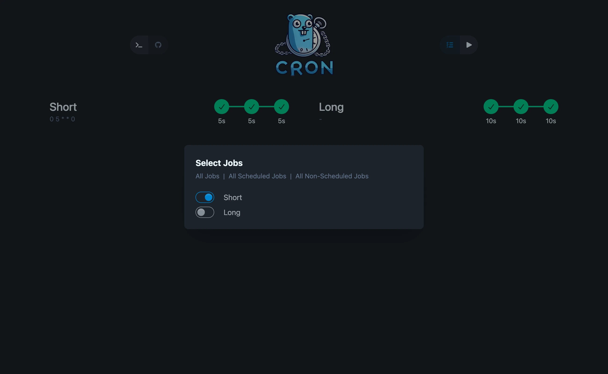

## ✨ New Features

- Possibility to disable cron scheduling in config for a specific job

  ```yaml
  jobs:
    - name: 'Disabled cron'
      envs:
        - key: SLEEP_TIME_LONG
          value: '90'
      # this will disable the scheduling for this job
      disable_cron: true
      commands:
        - sleep ${SLEEP_TIME_LONG}
        - echo "Job Done!"
  ```

- Possibility to select jobs for run in GUI

  

## 🐛 Bug Fixes

- Run counter would run even though the run was finished if it took only 0s
